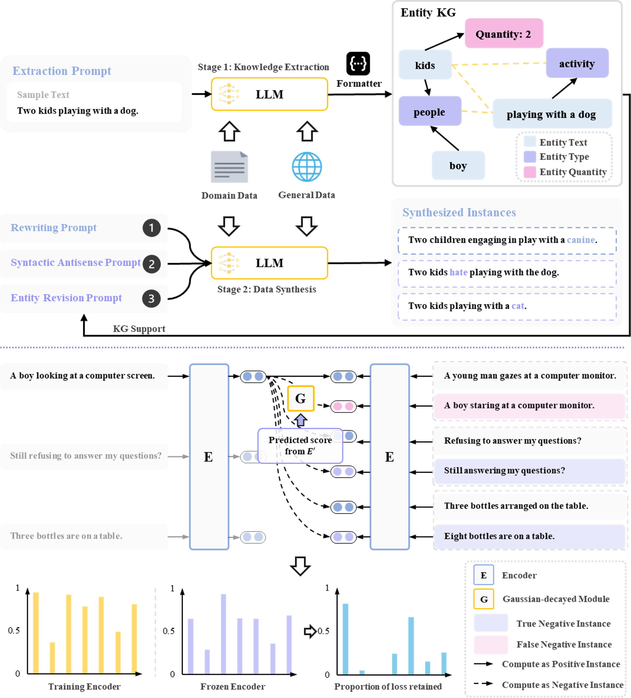

## Enhancing Unsupervised Sentence Embeddings via Knowledge-Driven Data Augmentation and Gaussian-Decayed Contrastive Learning

<p align="center">
    
</p>

## Overview

Current unsupervised sentence embedding methods face two critical limitations: (1) *low diversity* in augmented data due to LLMs' tendency to generate generic paraphrases while neglecting fine-grained knowledge (e.g., entities/quantities), and (2) *noisy training signals* from false negatives that distort the semantic space. To address this, we proposes a **knowledge-guided synthesis pipeline** where domain entities are first extracted to construct a lightweight knowledge graph, steering LLMs to generate semantically rich variations of input sentences. For noise suppression, we design a self-correcting contrastive learning mechanism: a Gaussian-decayed gradient function automatically identifies potential false negatives during training and temporarily attenuates their gradient updates, allowing the model to first consolidate reliable patterns before refining ambiguous cases.

## Quick Links

  - [Model Checkpoints](#model-checkpoints)
  - [Data Synthesis](#⚙️-installation-guide)
  - [Train GCSE](#🔥-run-sentence-embedding-models)
  - [Citation](#📚-citation)

## Model Checkpoints

We release our model checkpoints in huggingface as listed below:
| Model                                                                             | Avg. STS |
| :-------------------------------------------------------------------------------- | :------: |
| [aleversn/GCSE-BERT-base](https://huggingface.co/aleversn/GCSE-BERT-base)         |  81.98   |
| [aleversn/GCSE-BERT-large](https://huggingface.co/aleversn/GCSE-BERT-large)       |  83.07   |
| [aleversn/GCSE-RoBERTa-base](https://huggingface.co/aleversn/GCSE-RoBERTa-base)   |  82.12   |
| [aleversn/GCSE-RoBERTa-large](https://huggingface.co/aleversn/GCSE-RoBERTa-large) |  83.82   |

> Some results may differ from those reported in the paper due to the regeneration of the dataset.

## GCSE

Gaussian-decayed Gradient-assisted Contrastive Sentence Embedding is an unsupervised framework that:  
- Enhances semantic diversity via **knowledge graph-guided LLM paraphrasing**  
- Reduces noise with **adaptive false negative suppression** during contrastive optimization  

## ⚙️ Installation Guide

### Core Dependencies

Alternatively, install all dependencies with:

```bash
pip install -r requirements.txt
```

### vLLM Setup (Recommended)

```bash
conda create -n vllm python=3.12 -y
conda activate vllm
pip install vllm  # Requires CUDA 12.0+
```

For other installation options, refer to the official [vLLM installation guide](https://docs.vllm.ai/en/latest/getting_started/installation/gpu.html).

---

## 📊 Data Synthesis Pipelines

Our code supports both Jupyter Notebooks and command-line interfaces.

### Usage

**Option A: Jupyter Notebook**

* Set `cmd_args = False` in `0_collect_data.py`
* Configure the following:

  * `file_dir`: Directory to save data
  * `output_name`: Name of the output file

**Option B: Command Line**
Set `cmd_args = True` and run:

```bash
cd pipelines/
python 0_collect_data.py --file_dir=<dir> --output_name=<name>
```

---

### Step 0: Data Collection

To merge all `.txt` datasets into a single file, run:

```bash
cd pipelines/
python 0_collect_data.py --file_dir=<dir> --output_name=<name>
```

> ⚠️ Note: The `output_name` will automatically be prefixed with `__`. Ensure that your original dataset filenames do **not** contain `__` to avoid unintended file merges.

---

### Step 1: Extract Named Entities

**Using vLLM (Recommended)**:

```bash
cd pipelines/
python 1_extract_entities.py --file_dir=<dir> --file_name=__combine.txt --save_type_name=<model_name> --model_from_pretrained=<path> --batch_size=1000 --vllm=1
```

**With Tensor Parallelism**:

```bash
python 1_extract_entities.py --n_gpu=0,1 --file_dir=<dir> --file_name=__combine.txt --save_type_name=<model_name> --model_from_pretrained=<path> --batch_size=1000 --vllm=1 --tensor_parallel_size=2
```

**Using HuggingFace Models**:

```bash
python 1_extract_entities.py --file_dir=<dir> --file_name=__combine.txt --save_type_name=<model_name> --model_from_pretrained=<path> --batch_size=20
```

**Using OpenAI API**:

1. Create an `api_key.txt` file under `pipeline/` with:

   ```text
   OpenAI <API_KEY>
   Deepseek <API_KEY>
   ```
2. Run:

   ```bash
   python 1_extract_entities.py --file_dir=<dir> --file_name=__combine.txt --llm_name=deepseek-chat --save_type_name=Deepseek_V3
   ```

**Output**:

* `<file_name>_<save_type_name>_DA/<file_name>_entities.tsv`

**Optional Parameters**:

* Skip reasoning steps: `--skip_thinking=1`
* By default, `llm_name` equals `save_type_name` (except for OpenAI or GLM3)

---

### Step 2: Extract Key Entities (Main Parts)

Same options as Step 1 apply.

**Output**:

* `<file_name>_<save_type_name>_DA/<file_name>_main_parts.tsv`

---

### Step 3: Construct Named Entity Knowledge Graph

Ensure the frozen sentence embedding model is trained beforehand.

```bash
python 3_construct_entity_kg.py --file_dir=<dir> --file_name=__combine.txt --save_type_name=<model_name> --model_from_pretrained=<frozen_model_path> --batch_size=1024
```

**Output**:

* `<file_name>_<save_type_name>_DA/<file_name>_entities.jsonl`

---

### Step 4: Construct Main Parts Knowledge Graph

```bash
python 4_construct_main_parts_kg.py --file_dir=<dir> --file_name=__combine.txt --save_type_name=<model_name> --model_from_pretrained=<frozen_model_path> --batch_size=1024
```

**Output**:

* `<file_name>_<save_type_name>_DA/<file_name>_main_parts.jsonl`

---

### Step 5: Generate Extension Data from Knowledge Graphs

Can be run multiple times to generate more data.

**Using vLLM (Recommended)**:

```bash
cd pipelines/
python 5_generation_ext.py --file_dir=<dir> --file_name=__combine.txt --save_type_name=<model_name> --model_from_pretrained=<path> --batch_size=1000 --vllm=1
```

**Output**:

* `<file_name>_<save_type_name>_DA/<file_name>_ext_ori.tsv`

---

### Step 6: Format Extension Data

```bash
python 6_format_ext.py --file_dir=<dir> --file_name=__combine.txt --save_type_name=<model_name>
```

**Output**:

* `<file_name>_<save_type_name>_ext.txt`

---

### 🔁 Repeat Steps 1–4 for the New Extension File

Use `<file_name>_<save_type_name>_ext.txt` as input.

---

### Step 7: Generate Positive & Negative Samples

**Using vLLM (Recommended)**:

```bash
cd pipelines/
python 7_generate_samples.py --file_dir=<dir> --file_name=<file_name> --save_type_name=<model_name> --model_from_pretrained=<path> --batch_size=1000 --vllm=1
```

**Output**:

* `<file_name>_<save_type_name>_DA/<file_name>_syn_samples.tsv`

---

### Step 8: Format Generated Samples

```bash
python 8_process_generation.py --file_dir=<dir> --file_name=__combine.txt --save_type_name=<model_name>
```

**Output**:

* `<file_name>_<save_type_name>_DA/<file_name>_<save_type_name>_syn_samples.jsonl`

---

### Step 9: Denoise Generated Data

Ensure your frozen sentence embedding model is available.

```bash
python 9_denoise_generation.py --file_dir=<dir> --file_name=__combine.txt --save_type_name=<model_name> --model_from_pretrained=<frozen_model_path> --batch_size=128
```

**Output**:

* `<file_name>_<save_type_name>_syn_train.jsonl`

---

### 📌 Final Step

Manually merge all `*_syn_train.jsonl` files into a single file, and specify its path in `present.json`.

---

## 🔥 Run Sentence Embedding Models

### Training with `SimCSE`

* **Model**: BERT / RoBERTa

```python
import os
from main.trainers.cse_trainer import Trainer
from transformers import BertTokenizer

tokenizer = BertTokenizer.from_pretrained('<PATH>')
trainer = Trainer(
    tokenizer=tokenizer,
    from_pretrained='<PATH>',
    data_present_path='./dataset/present.json',
    max_seq_len=32,
    hard_negative_weight=0,
    batch_size=64,
    temp=0.05,
    data_name='DomainFullUn',
    task_name='SimCSE_DomainFullUn_unsup'
)

for i in trainer(num_epochs=3, lr=2e-5, gpu=[0], eval_call_step=lambda x: x % 125 == 0, save_per_call=True):
    a = i
```

#### Dataset Format

Specify the dataset path using the `data_present_path` argument. The file should be a JSON object with the following format:

```json
{
    "DomainFullUn": {
        "train": "./dataset/train.jsonl",
        "dev": "./dataset/stsbenchmark/sts-dev.json"
    }
}
```

#### Evaluation Only

To run evaluation only, comment out the training loop above and run:

```python
trainer.eval(0, is_eval=True)
```

---

### Training with `GCSE`

* **Model**: BERT / RoBERTa

```python
import os
from main.trainers.gcse_trainer import Trainer
from transformers import AutoTokenizer

tokenizer = AutoTokenizer.from_pretrained('<PATH>')
trainer = Trainer(
    tokenizer=tokenizer,
    from_pretrained='<PATH>',
    base_from_pretrained='<PATH>',
    data_present_path='./dataset/present.json',
    max_seq_len=64,
    hard_negative_weight=0,
    batch_size=128,
    temp=0.05,
    data_name=f'{args.data_name}',
    task_name=f'GCSE_{args.data_name}_unsup'
)

for i in trainer(num_epochs=2, lr=1e-5, gpu=[0], eval_call_step=lambda x: x % 125 == 0, save_per_call=True):
    a = i
```

#### Example `train.py` Command

Make sure to enable `cmd_args=True`:

```bash
python train.py --n_gpu=0 --data_name=<DATA_NAME> --model=<PATH>
```

---

### Evaluation with `SentEval` (Requires Numpy 1.23.5)

You can evaluate model performance using three different approaches:

#### 1. Shell Script Execution

If `tokenizer_path` is not provided, it defaults to `model_name_or_path`.

```bash
python main/evaluation.py --model_name_or_path='./model/bert-base-uncased' --tokenizer_path='./model/bert-base-uncased'
```

#### 2. Python Notebook Execution

By default, the model type is inferred from `model_name_or_path`.

```python
from main.evaluation import *

model_path = '<PATH>'
tokenizer_path = '<PATH>'

main([
    '--model_name_or_path', model_path,
    '--tokenizer_path', tokenizer_path,
    '--task_set', 'sts'
])
```

Available options for `task_set`: `['sts', 'transfer']`

#### 3. Custom Model Evaluation

Use this method to avoid missing parameters when using models defined in this project:

```python
from main.evaluation import *
from main.models.gcse import GCSE

model_path = '<PATH>'
tokenizer_path = '<PATH>'
model = GCSE(from_pretrained=model_path, pooler_type='cls')

main([
    '--model_name_or_path', model_path,
    '--tokenizer_path', tokenizer_path,
    '--task_set', 'sts'
], model)
```

#### Example `eval.py` Command

Enable `cmd_args=True`:

```bash
python eval.py --n_gpu=0 --task_set=sts --model_name_or_path=<PATH> --tokenizer_path=<PATH>
```

---

### NLI Training

* **Model**: BERT / SBERT

```python
from main.trainers.sts_trainer import Trainer
from transformers import BertTokenizer

tokenizer = BertTokenizer.from_pretrained('./model/chinese_wwm_ext')
trainer = Trainer(
    tokenizer=tokenizer,
    from_pretrained='./model/chinese_wwm_ext',
    model_type='bert',
    data_present_path='./dataset/present.json',
    max_seq_len=128,
    hard_negative_weight=0,
    batch_size=64,
    temp=0.05,
    data_name='CNSTS',
    task_name='BERT_CNSTS'
)

for i in trainer(num_epochs=15, lr=5e-5, gpu=[0], eval_call_step=lambda x: x % 250 == 0):
    a = i
```

#### Evaluation Only

Comment out the training loop to evaluate directly:

```python
trainer.eval(0, is_eval=True)
```

## 📚 Citation
```bibtex
@inproceedings{lai2025gcse,
      title={Enhancing Unsupervised Sentence Embeddings via Knowledge-Driven Data Augmentation and Gaussian-Decayed Contrastive Learning}, 
      author={Peichao Lai and Zhengfeng Zhang and Wentao Zhang and Fangcheng Fu and Bin Cui},
      year={2025},
      booktitle={Proceedings of the 63rd Annual Meeting of the Association for Computational
                  Linguistics, {ACL} 2025}
}
```
